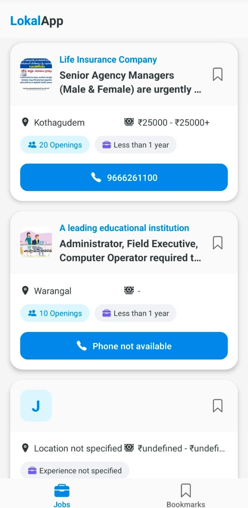
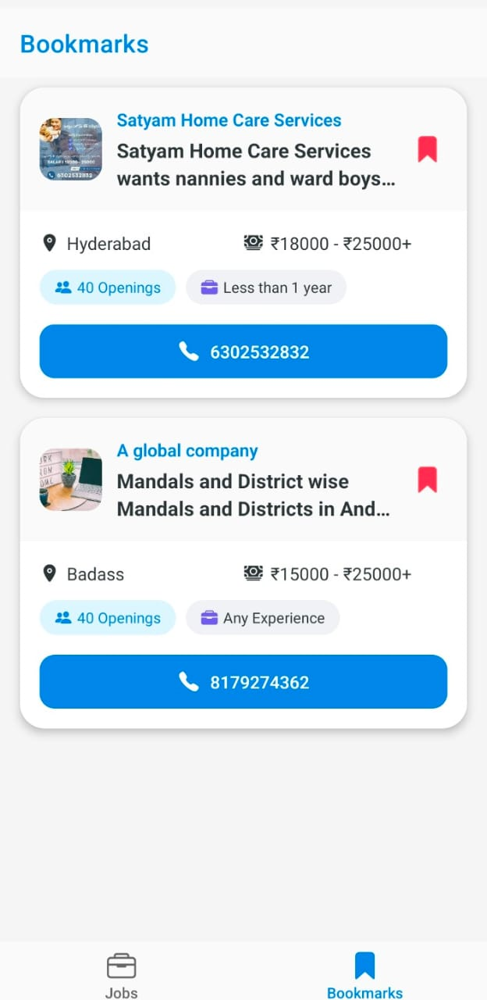
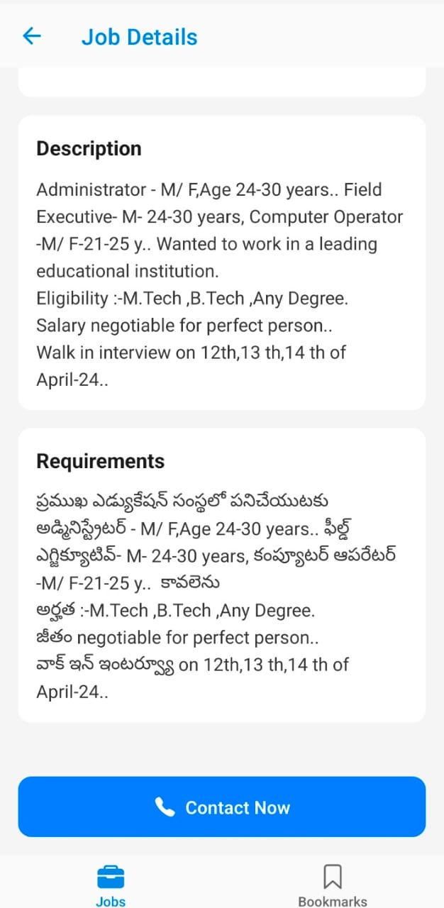

# Lokal App React Native Assignment

## Overview
Lokal Job Search is a comprehensive mobile application built with React Native that connects job seekers with local employment opportunities. This app was developed as part of the Lokal App assignment, showcasing a modern approach to local job hunting.

## Mobile Preview
Here are some snapshots of the Local App:

<p align="center">
  
  
</p>

<p align="center">
   
  
</p>


## Demo Video
Watch the app demonstration here:
[Demo Video Link](https://drive.google.com/file/d/1DaHv9aRmKL7gNFbj525UMpS1vk7mbew1/view?usp=sharing)

## Repository
Access the complete source code here:
[GitHub Repository](https://github.com/shuklaAlkesh/Lokal-react-native-assignment.git)

## Features
- Clean and intuitive user interface
- Smooth navigation between screens
- Data fetching and display
- State management implementation
- Responsive design for various screen sizes

## Technologies Used
- React Native
- JavaScript/TypeScript
- React Navigation
- Expo
- Axios for API calls
- AsyncStorage for local storage
- React Native Paper (UI components)

## Installation Guide

1. **Clone the Repository**
   ```bash
   git clone https://github.com/shuklaAlkesh/Lokal-react-native-assignment.git
   ```

2. **Navigate to Project Directory**
   ```bash
   cd Lokal-react-native-assignment
   ```

3. **Install Dependencies**
   ```bash
   npm install
   # or
   yarn install
   ```

4. **Start the Development Server**
   ```bash
   npx expo start
   ```
